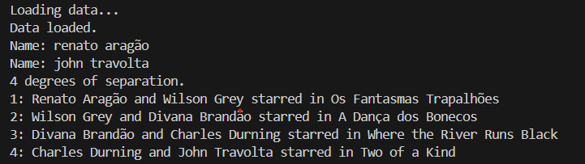

# Harvard_AI_Introduction

Projetos desenvolvidos durante o curso gratuito da Universidade de Harvard: [CS50's Introduction to Artificial Intelligence with Python](https://cs50.harvard.edu/ai/).

Este repositório contém implementações práticas de conceitos fundamentais de Inteligência Artificial, como busca em grafos, lógica proposicional, teoria de jogos, redes bayesianas e aprendizado de máquina.

---

## 📁 Estrutura dos Projetos

Cada pasta corresponde a um projeto desenvolvido no curso. Veja abaixo a descrição de cada um:

### 📦 `degrees - Projeto 1`

- **Objetivo:** Encontrar o grau de separação entre dois atores com base em filmes compartilhados.
- **Conceitos aplicados:** Busca em grafos (BFS), estrutura de dados (fila, conjunto), representação de conhecimento.
- **Entrada esperada:** Nome de duas pessoas.
- **Saída:** Caminho mais curto de filmes conectando os dois atores.
- **Requisitos:** O projeto exigiu Python 3.12. como versão máxima.
- **Como executar:** Entre na pasta degrees (`cd degrees`) e execute `python degrees.py`.
- **Demonstração:**
  


---

### 📦 `tic_tac_toe - Projeto 2`

- **Objetivo:** Implementar um agente inteligente que joga Jogo da Velha (Tic-Tac-Toe).
- **Conceitos aplicados:** Teoria dos jogos, Minimax, árvore de decisão.
- **Destaques:** Agente nunca perde (empata ou vence).

---

## 🧠 Conceitos aprendidos

- Representação e busca em grafos

---

## 🛠️ Requisitos

- Algumas pastas podem conter um `requirements.txt`

Para instalar dependências (caso existam):

```bash
pip install -r requirements.txt
