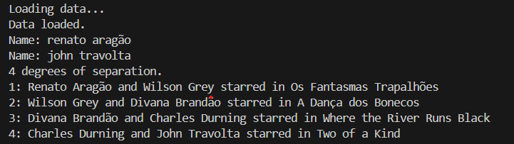
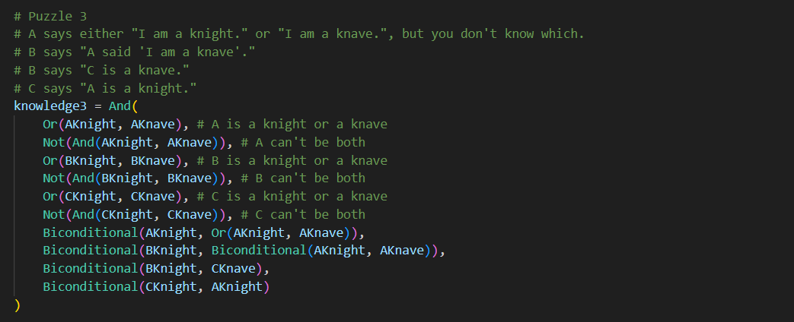
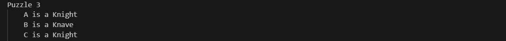
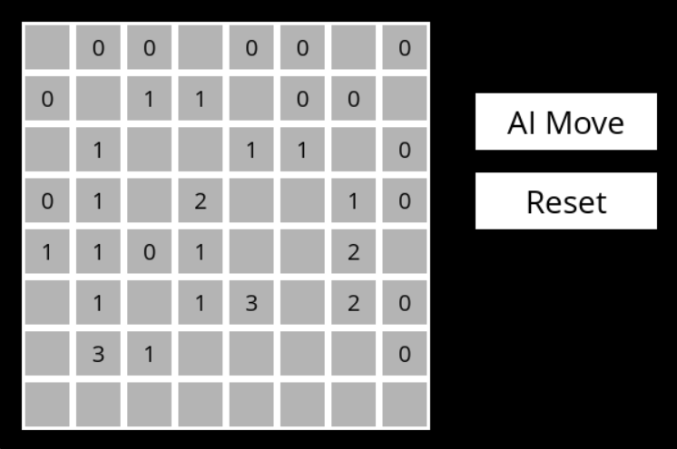

# Harvard_AI_Introduction

Projetos desenvolvidos durante o curso gratuito da Universidade de Harvard: [CS50's Introduction to Artificial Intelligence with Python](https://cs50.harvard.edu/ai/).

Este repositório contém implementações práticas de conceitos fundamentais de Inteligência Artificial, como busca em grafos, lógica proposicional, teoria de jogos, redes bayesianas e aprendizado de máquina.

---

## 📁 Estrutura dos Projetos

Cada pasta corresponde a um projeto desenvolvido no curso. Veja abaixo a descrição de cada um:

### 📦 `01_degrees`

- **Objetivo:** Encontrar o grau de separação entre dois atores com base em filmes compartilhados.
- **Conceitos aplicados:** Busca em grafos (BFS), estrutura de dados (fila, conjunto), representação de conhecimento.
- **Entrada esperada:** Nome de duas pessoas.
- **Saída:** Caminho mais curto de filmes conectando os dois atores.
- **Como executar:** Entre na pasta 01_degrees (`cd 01_degrees`) e execute `python degrees.py`.
- **Demonstração:**
  


---

### 📦 `02_tic_tac_toe`

- **Objetivo:** Implementar um agente inteligente que joga Jogo da Velha (Tic-Tac-Toe).
- **Conceitos aplicados:** Minimax, árvore de decisão.
- **Observações:** O agente nunca perde (ou empata ou vence).
- **Como executar:** Entre na pasta 02_tic_tac_toe (`cd 02_tic_tac_toe`) e execute `python runner.py`.
- **Demonstração:**
  


---

### 📦 `03_knights`

- **Objetivo:** Resolver o problema do cavaleiro lógico (Knights and Knaves) usando lógica proposicional.
- **Conceitos aplicados:** Modelagem de conhecimento, inferência lógica, model_checking.
- **Saída:** Quem é o cavaleiro (Knight) e o vilão (Knave) com base no conhecimento da IA.
- **Como executar:** Entre na pasta 03_knights (`cd 03_knights`) e execute `python puzzle.py`.
- **Demonstração:**
  



---

### 📦 `04_minesweeper`

- **Objetivo:** Criar um agente para jogar campo minado.
- **Conceitos aplicados:** Inferência lógica, probabilidade, raciocínio baseado em regras.
- **Observações:** O agente nem sempre tem conhecimento de um caminho seguro. No terminal, é dito se ele tinha esse conhecimento ou fez um chute.
- **Como executar:** Entre na pasta 04_minesweeper (`cd 04_minesweeper`) e execute `python runner.py`.
- **Demonstração:**
  


---

## 🧠 Conceitos aprendidos

- Representação e busca em grafos
- Algoritmos de jogos (Minimax)
- Modelagem lógica e inferência

---

## 🛠️ Requisitos

- O curso exige o uso do Python 3.12 como versão máxima, portanto não é garantido que todos os projetos funcionem acima dessa versão.

- Algumas pastas podem conter um `requirements.txt`. Verifique se esse arquivo existe antes de testar um projeto.

Para instalar dependências (caso existam):

```bash
pip install -r requirements.txt
